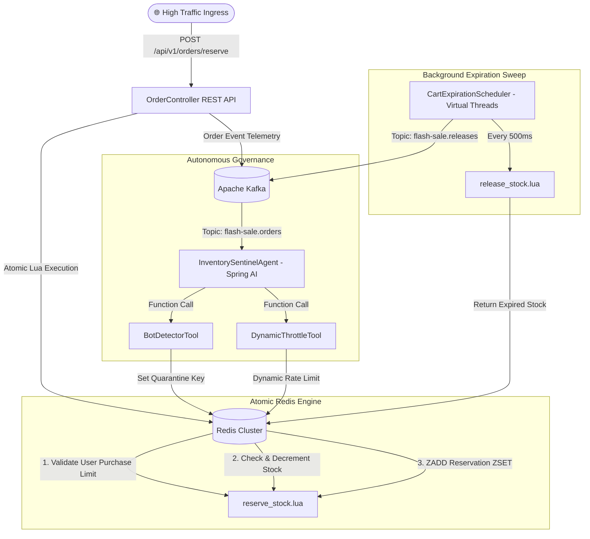

# ⚡ Enterprise Agentic Flash-Sale & Inventory Governance System

[](https://jdk.java.net/23/)
[](https://spring.io/projects/spring-boot)
[](https://redis.io/)
[](https://kafka.apache.org/)
[](https://spring.io/projects/spring-ai)

An enterprise-grade, high-concurrency **Flash-Sale & Inventory Governance System** built with **Spring Boot 3.3**, **Java 23 Virtual Threads**, **Redis Lua Atomic Scripts**, **Apache Kafka**, and **Spring AI Autonomous Sentinel Agents**.

Designed to handle 100,000+ surge requests per second while enforcing **strict zero-overselling guarantees**, automated cart expiration sweeps, and AI-driven botnet scraper detection.

---

## 📐 Architecture & System Overview



---

## ⚡ Key Architectural Features

1. **Zero-Overselling via Atomic Redis Lua Scripts**:
   - Executes stock availability checks, quantity updates, and per-user purchase limit validations atomically in single roundtrips.
   - Enforces Redis Hash Slot Tagging (`{sku:ID}`) for cluster shard safety.

2. **Automated Cart Expiration Sweep**:
   - Uses Java 23 Virtual Threads in a background scheduler polling Redis ZSETs every 500ms.
   - Automatically releases unpurchased cart stock back to inventory upon TTL expiration.

3. **High-Throughput Kafka Telemetry Pipeline**:
   - SKU-partitioned ordering on Kafka topic `flash-sale.orders`.
   - Consumer containers backed by Virtual Thread per-task executors (`Executors.newVirtualThreadPerTaskExecutor()`).

4. **Autonomous AI Sentinel Agent (Spring AI + Function Calling)**:
   - Evaluates order telemetry via OpenAI LLM tool calling.
   - Dynamically triggers `BotDetectorTool` (Redis quarantine) and `DynamicThrottleTool` (IP rate limiting) for automated scraper attacks.

5. **Live Interactive Dashboard**:
   - Glassmorphism dark-mode UI embedded at `http://localhost:8080/` featuring real-time stock gauge counters, traffic scenario triggers, and AI telemetry logs.

---

## 🚀 Getting Started

### Prerequisites
- **Java JDK 23**
- **Apache Maven 3.9+**
- **Redis Server** (Port `6379`)
- **Apache Kafka** (Port `9092`)

### 1. Clone & Run External Services
```bash
# Redis Container
docker run -d --name flashsale-redis -p 6379:6379 redis:alpine

# Kafka Container
docker run -d --name kafka -p 9092:9092 apache/kafka:latest
```

### 2. Build and Start Application
```bash
# Build project
mvn clean compile

# Run application
mvn spring-boot:run
```

Access the Live Control Dashboard at: `http://localhost:8080`

---

## 🧪 Testing & Verification

Run the Karate BDD load and concurrency test suite:

```bash
mvn test -Dtest=KarateTestRunner
```

---

## 🛠️ API Reference

| Endpoint | Method | Description | Sample Request |
| :--- | :--- | :--- | :--- |
| `/api/v1/admin/inventory/reset` | `POST` | Set baseline stock | `{ "skuId": "SKU_1001", "stock": 100 }` |
| `/api/v1/orders/reserve` | `POST` | Reserve flash sale item | `{ "skuId": "SKU_1001", "userId": "user_1", "quantity": 1 }` |
| `/api/v1/inventory/{skuId}` | `GET` | Get current stock | *N/A* |

---

## 📄 License
MIT License.
